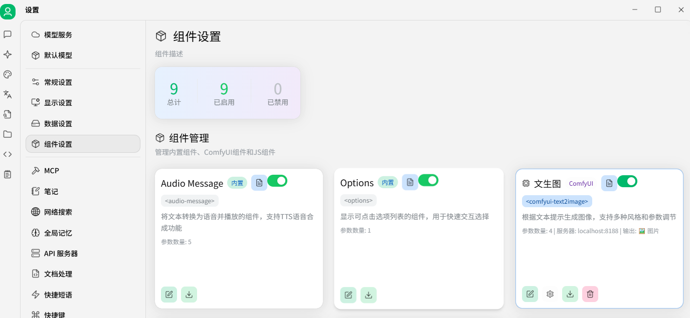
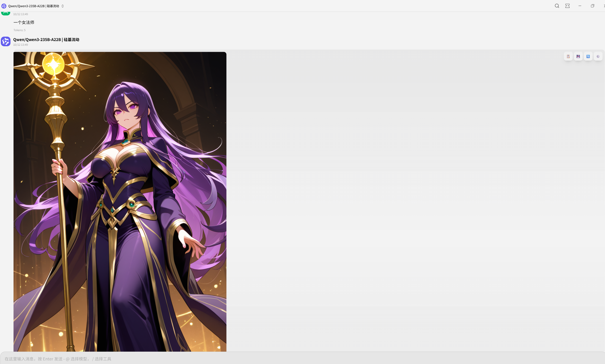

# Cherry Studio Magic

English | [简体中文](README.zh-CN.md)

Cherry Studio Magic is a streamlined fork of the official Cherry Studio focused on built-in, production-ready components and a cleaner developer experience.

- Upstream: https://github.com/CherryHQ/cherry-studio
- This project: https://github.com/xiao-ge008/cherry-studio-magic

The goal is to keep the core experience while adding a few high‑value components and removing non‑essential tests and internal tooling to make the project easier to clone, build, and customize.

## Differences vs Official

- Built‑in, ready‑to‑use components:
  - Options Component: render interactive option blocks inside messages (toggle/switch/dropdown)
  - TTS Component: play assistant speech audio inline with message flow
  - ComfyUI Component: preview and run ComfyUI workflows directly in chat
  - HTML Render Component: safely render HTML blocks inside messages with scoped styles
- Leaner repository:
  - Tests, snapshots, and debug artifacts removed
  - Focus on production usage and custom extension

## Components Overview

### Options Component

Renders interactive options embedded in markdown/assistant messages for quick actions and configuration.

### TTS Component

Inline text‑to‑speech playback for assistant messages. Supports queued playback and basic controls.

### ComfyUI Component

Integrates ComfyUI workflows: preview graphs, trigger runs, and show results within the chat.

Advanced workflow preview example:

### HTML Render Component

Safely render HTML blocks with scoped styles in messages. Useful for richly formatted responses.

## Getting Started

### Prerequisites

- Node.js >= 22 (Corepack/Yarn 4 recommended)

### Install and Run (Development)

yarn install
yarn dev

### Build (Production)

yarn build

Artifacts are generated to `out/` (main, preload, renderer).

### Windows Packaging

yarn build:win:x64

If native modules rebuild is required, ensure Visual Studio Build Tools with C++ workload and Windows SDK are installed.

## Project Structure

- `src/main/` Electron main process (IPC, services, API server)
- `src/preload/` Preload scripts (context bridge)
- `src/renderer/` React app (UI, components, stores)
- `build/` Icons and packaging assets

## License

Cherry Studio Magic follows the upstream dual licensing model:
- Individuals and orgs ≤ 10 people: AGPLv3
- Orgs > 10 people or need closed distribution (avoid AGPL obligations): Commercial License (contact: bd@cherry-ai.com)

Please review the LICENSE file for full details.

## Acknowledgements

Special thanks to the official Cherry Studio team and community. If this project helps you, please also star and support the upstream project:
- https://github.com/CherryHQ/cherry-studio
